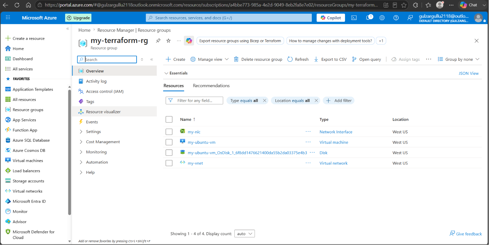
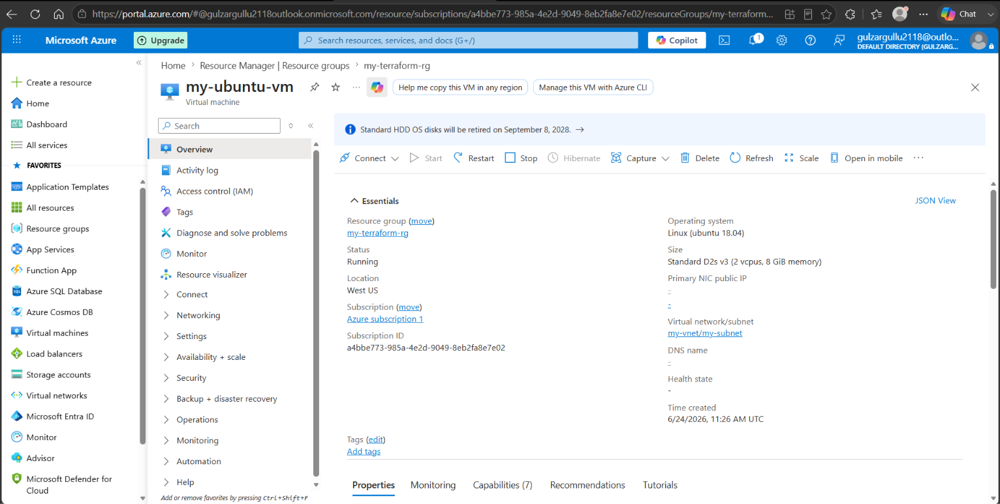
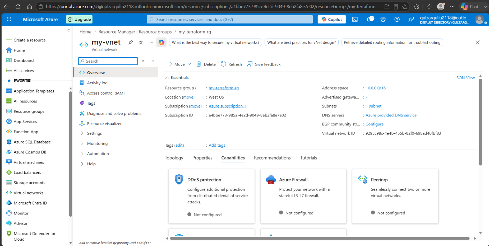

# ☁️ Infrastructure as Code on Azure | Terraform


## 📌 Project Overview

This project automates the deployment of a complete cloud infrastructure on **Microsoft Azure** using **Terraform** — no manual clicking in the Azure Portal. Everything is defined as code, making it repeatable, consistent, and version controlled.

> 💡 **Key Concept:** Instead of manually creating cloud resources one by one, Terraform reads our code and provisions everything automatically in minutes.

---

## 🏗️ Architecture

The following resources are deployed automatically via Terraform:

| Resource | Name | Purpose |
|---|---|---|
| 📦 Resource Group | `my-terraform-rg` | Container for all resources |
| 🌐 Virtual Network | `my-vnet` | Private cloud network (10.0.0.0/16) |
| 🔀 Subnet | `my-subnet` | Network segment (10.0.1.0/24) |
| 🔌 Network Interface | `my-nic` | Connects VM to the network |
| 🖥️ Linux Virtual Machine | `my-ubuntu-vm` | Ubuntu 18.04 VM (Standard_D2s_v3) |
| 💾 Azure Blob Storage | `tfstate` | Remote Terraform state storage |

---

## 📸 Screenshots

### Azure Resource Group — All Resources Deployed

### Virtual Machine — Running on Azure

### Virtual Network



## 📁 Project Structure
azure-terraform-project/

├── main.tf          # Core infrastructure resources

├── variables.tf     # Input variables and default values

├── backend.tf       # Remote state configuration (Azure Blob Storage)

├── outputs.tf       # Output values after deployment

├── .gitignore       # Excludes Terraform provider files

└── README.md        # Project documentation
---

## ⚙️ Prerequisites

Before running this project, make sure you have:
- [Terraform](https://developer.hashicorp.com/terraform/install) installed
- [Azure CLI](https://learn.microsoft.com/en-us/cli/azure/install-azure-cli) installed
- An active Azure subscription
- An SSH key pair generated on your machine (`ssh-keygen -t rsa -b 2048`)

---

## 🚀 Setup & Deployment

### Step 1 — Login to Azure
```bash
az login
```

### Step 2 — Create Storage Account for Terraform State
```bash
az group create --name terraform-state-rg --location westus
az storage account create --name tfstate201gul --resource-group terraform-state-rg --location westus --sku Standard_LRS
az storage container create --name tfstate --account-name tfstate201gul
```

### Step 3 — Initialize Terraform
```bash
terraform init
```

### Step 4 — Preview the Changes
```bash
terraform plan
```

### Step 5 — Deploy the Infrastructure
```bash
terraform apply
```
Type `yes` when prompted.

### Step 6 — Destroy the Infrastructure (when done)
```bash
terraform destroy
```

---

## 📤 Output Example

After successful deployment, Terraform displays:
resource_group_name  = "my-terraform-rg"

virtual_network_name = "my-vnet"

subnet_name          = "my-subnet"

vm_name              = "my-ubuntu-vm"

vm_private_ip        = "10.0.1.4"

---

## 🛠️ Technologies Used

| Tool | Purpose |
|---|---|
| Terraform | Infrastructure as Code |
| Microsoft Azure | Cloud Provider |
| Azure CLI | Command line interface for Azure |
| HCL | HashiCorp Configuration Language |
| Git & GitHub | Version control & portfolio hosting |

---

## 💡 Key Learnings

- How to write Terraform HCL to define cloud infrastructure
- How to manage Terraform state remotely using Azure Blob Storage
- How to troubleshoot VM size availability across Azure regions
- How to use Git for version controlling infrastructure code